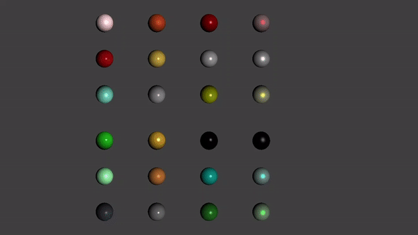

# OpenGL_Demos
This repo contains OpenGL applications developed on Windows, Linux & macOS which includes lighting and texturing.
It includes different shapes such as:
  - Triangle
  - Rectangle
  - Pyramid
  - Cube
  - Sphere

Shapes have been rendered using per-vertex or per-pixel(per-fragment)lighting.

